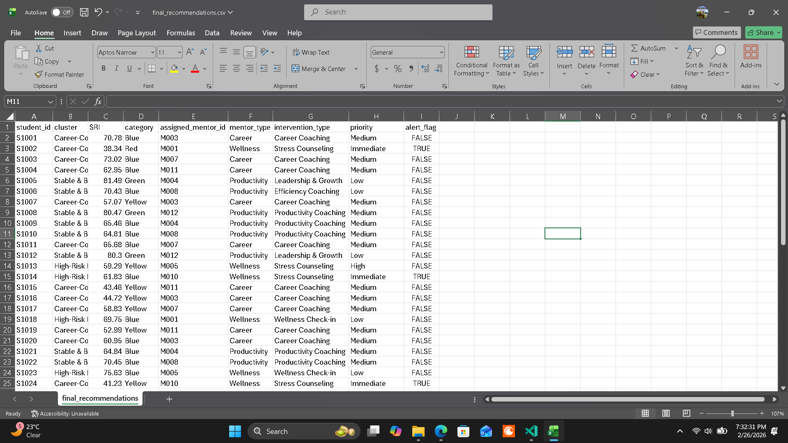
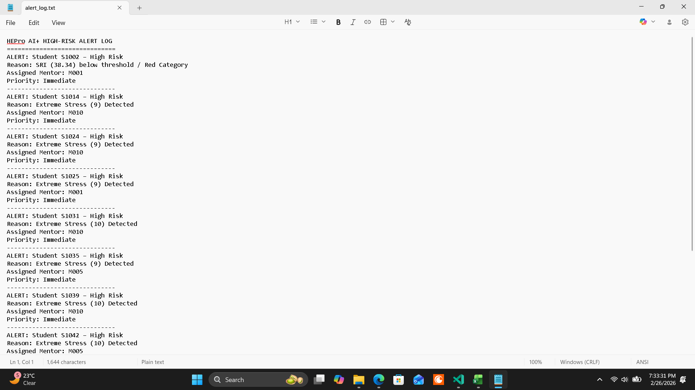
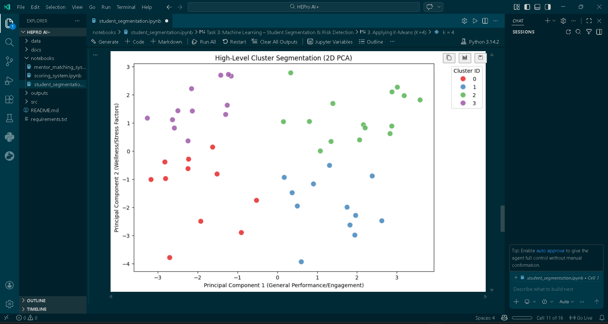

# HEPro AI+ 🚀
### AI-powered Decision Intelligence System for Proactive Student Mentoring

> 🚨 AI system that identifies at-risk students BEFORE failure and automatically assigns the right mentor using hybrid intelligence.


---

## 🎯 Problem Solved
Institutions lack systems that proactively identify struggling students and take action before failure occurs.

HEPro AI+ bridges this gap by combining behavioral analytics with automated decision-making.

---

## 🧩 What is HEPro AI+?

HEPro AI+ is an AI-powered decision intelligence system designed to understand students beyond marks.

Instead of waiting for students to fail, this system proactively identifies:

* hidden stress
* declining engagement
* productivity issues
* career confusion

…and automatically recommends **what action should be taken — and who should take it**.

It transforms raw student data into **clear, actionable mentoring decisions**.

---

## ⚡ What This System Actually Does

- Detects hidden high-risk students (even if grades look fine)
- Identifies behavioral patterns using ML clustering
- Assigns the most suitable mentor automatically
- Generates real-time intervention recommendations

➡️ Output: Actionable mentoring decisions, not just analysis
➡️ Designed to support early intervention and reduce student failure rates through proactive decision-making.

---

## 💡 Why This Project Matters

Most systems only show *what is wrong*.
HEPro AI+ goes one step further — it answers:

> **“What should we do next?”**

This shift from analysis → action is what makes it a **Decision Intelligence System**, not just an ML project.

This makes it not just a monitoring tool, but a **decision-making engine**.

---

## 🔄 How the System Works (Step-by-Step)

### 1️⃣ Data Generation

The system starts with a realistic dataset of students containing:

* academic performance
* attendance
* stress & wellness indicators
* productivity & focus metrics

---

### 2️⃣ Rule-Based Scoring (SRI)

Each student is evaluated using a composite score:

**SRI (Student Readiness Index)** based on:

* Academic Performance (APS)
* Wellness (WWS)
* Productivity (PTMS)
* Career Readiness (CRS)

This ensures **interpretability and transparency**.

---

### 3️⃣ Machine Learning (Clustering)

Using **K-Means (K=4)**, students are grouped into behavioral personas such as:

* High-Achieving but Stressed
* Career Confused
* Stable & Balanced
* High-Risk Disengaged

This reveals behavioral patterns that traditional scoring completely misses.

---

### 4️⃣ Decision Intelligence Engine

This is the core of the system.

It decides:

* What is the student's biggest problem?
* What type of help is needed?
* Which mentor should be assigned?

Key logic:

* Wellness is always prioritized first
* High-risk students get immediate attention
* Mentor assignment is based on expertise + availability

---

### 5️⃣ Mentor Matching System

The system intelligently assigns:

* Career mentors
* Wellness counselors
* Productivity coaches

It also ensures:

* No mentor overload
* Balanced workload distribution

---

### 6️⃣ Outputs Generated

The system produces:

* 📄 `final_recommendations.csv`  
  → Includes cluster label, assigned mentor, intervention type, and priority level

* ⚠ `alert_log.txt`  
  → High-risk student alerts requiring immediate action

---

## 📊 Sample Outputs

These outputs demonstrate how HEPro AI+ transforms raw student data into actionable mentoring decisions with clear prioritization and intervention strategies.

### 🔹 Final Recommendations


### 🔹 High-Risk Alert Log


### 🔹 Cluster Visualization (Optional)


---

## 📁 Project Structure

```text
HEPro-AI-Plus/
│
├── assets/                    # Output screenshots
│   ├── final_recommendations_output.png
│   ├── alert.png
│   └── pca_cluster_visualization.png
|
├── data/                   # Input & processed datasets
│   ├── students.csv
│   ├── students_scored.csv
│   ├── students_clustered.csv
│   ├── mentors.csv
│   ├── mentors_assigned.csv
│   └── cluster_profiles.json
│
├── src/                    # Core system logic
│   ├── generate_data.py
│   ├── scoring_system.py
│   ├── run_clustering.py
│   └── run_matching.py
│
├── notebooks/              # Development & experimentation
│   ├── scoring_system.ipynb
│   ├── student_segmentation.ipynb
│   └── mentor_matching_system.ipynb
│
├── outputs/                # Final system outputs
│   ├── final_recommendations.csv
│   └── alert_log.txt
│
├── docs/                   # Supporting documentation
│   ├── SYSTEM_ARCHITECTURE.md
│   ├── SCORING_LOGIC.md
│   ├── CLUSTER_INSIGHTS.md
│   ├── DECISION_INTELLIGENCE_REPORT.md
│   └── MENTORING_GUIDE.md
│
├── requirements.txt
└── README.md
```

---

## 🚀 How to Run the Project

### Step 1: Install Dependencies

```bash
pip install -r requirements.txt
```

---

### Step 2: Run the Pipeline

```bash
python src/generate_data.py
python src/scoring_system.py
python src/run_clustering.py
python src/run_matching.py
```

---

## 📊 Data Flow

```
students.csv
   ↓
students_scored.csv
   ↓
students_clustered.csv
   ↓
final_recommendations.csv + alert_log.txt
```

## ⚡ Pipeline Snapshot

Data → Scoring → Clustering → Decision Engine → Mentor Assignment → Alerts

---

## 🧠 Key Features

* Hybrid AI Architecture (Rule-Based + Machine Learning)
* Explainable decision-making
* Early risk detection
* Smart mentor allocation
* Modular & scalable design

---

## 🚀 What Makes This Different?

- Not just prediction → **decision-making system**
- Combines **rule-based logic + ML (hybrid AI)**
- Prioritizes **wellness over academics**
- Includes **mentor capacity constraints**
- Fully **explainable (no black-box decisions)**

---

## 🔮 Future Improvements

* Feedback loop (learning from outcomes)
* Dashboard (Streamlit / Plotly)
* Real-time monitoring system
* Integration with institutional databases

---

## 💼 Use Case

This project demonstrates:
- Applied Machine Learning
- Decision Intelligence Systems
- Real-world problem solving
- Explainable AI design

Suitable for:
- AI/ML roles
- Data Science internships
- Backend + ML system design discussions

---

## ⚙️ Tech Stack

- Python
- Pandas, NumPy
- Scikit-learn (K-Means)
- Matplotlib / Seaborn
- Jupyter Notebook

---

## 📈 System Scale

- Simulated dataset of 50 students
- 12 mentors with capacity constraints
- End-to-end automated pipeline execution

---

# 👨‍💻 Author

Developer: **Harshit Sharma | [LinkedIn Profile](https://www.linkedin.com/in/harshit-sharma-b700b2353/)**

HEPro AI+ is not just analyzing students —  
it is **making the right decisions at the right time, for the right student**.

---

## ⭐ Support

If you found this project useful or interesting, consider giving it a ⭐ — it helps increase visibility and motivates further development.
